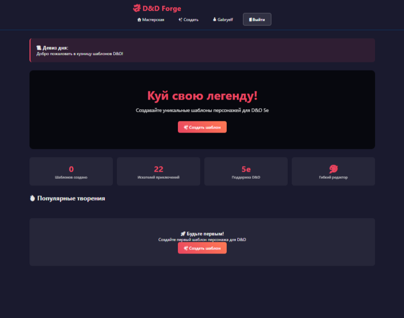
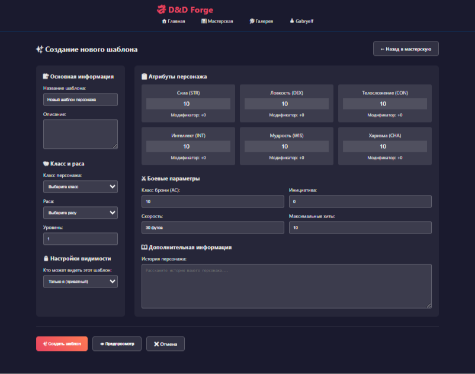
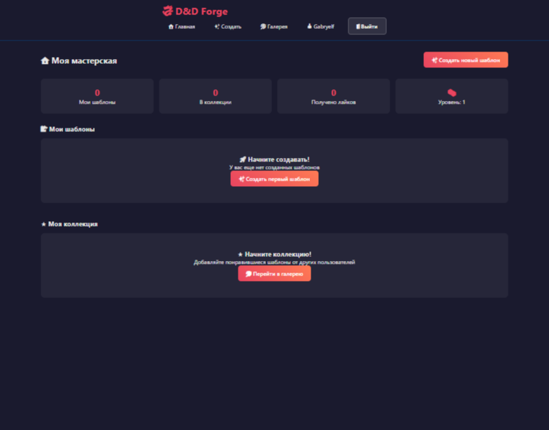
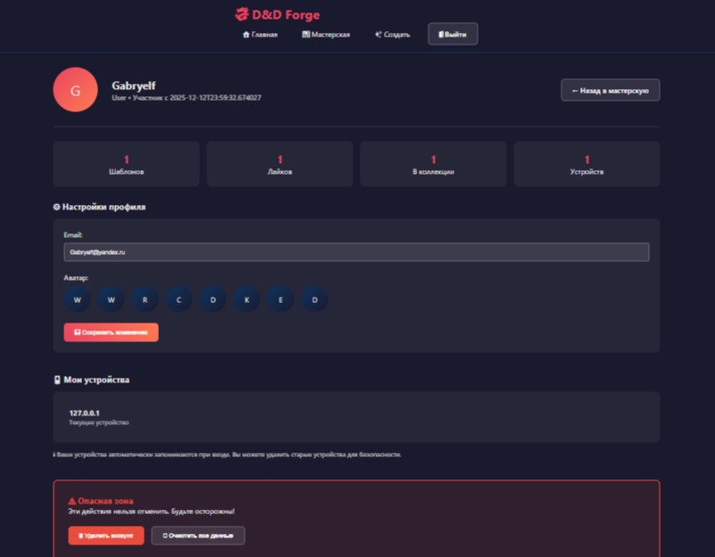
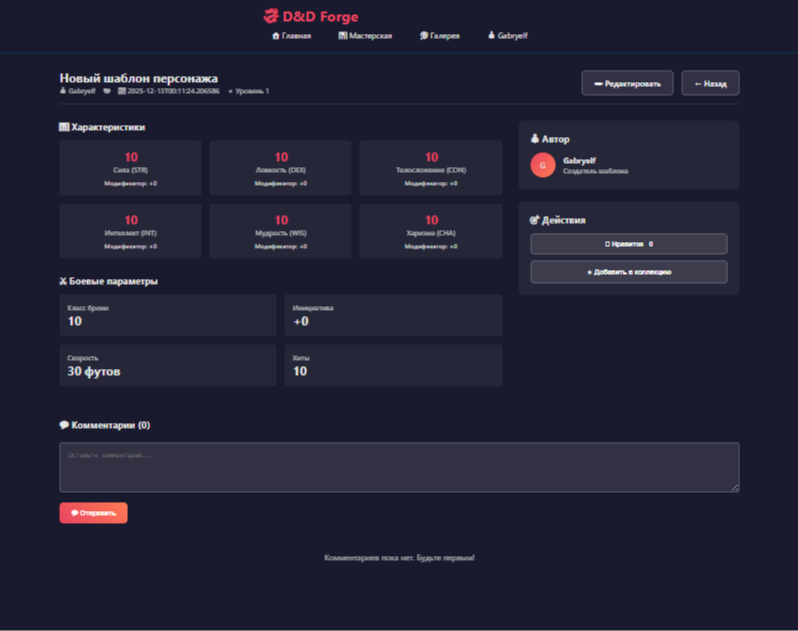

# 🎲 DND Issue Templates for GitHub


Умный инструмент для создания структурированных GitHub Issues с использованием шаблонов для DND-проектов и геймдева.

[English](#english) | [Русский](#русский)

---

## 📸 Скриншоты

| Главное меню | Создание шаблона |
|-----------------------------------|----------------------------|
|  |  |

| Коллекции | Настройки аккунта |
|-----------------------|---------------------|
|  |  |
|  | |

---

## ✨ Особенности

### 🎯 Для DND проектов
- **Специализированные шаблоны** для кампаний, персонажей, локаций
- **Автоматическое форматирование** для DND-контента
- **Поддержка Markdown** с DND-стилями

### 🔧 Технические возможности
- **Подключение нескольких репозиториев** GitHub
- **Безопасное хранение токенов** с шифрованием
- **Предпросмотр в реальном времени**
- **Автосохранение черновиков**
- **История активности**

### 🚀 Быстрый старт
- **Интуитивный интерфейс** - работайте за минуты
- **Готовые шаблоны** - экономьте время
- **Автодеплой** на Render.com

---

## 🚀 Быстрый старт

### Локальная установка

```bash
# Клонирование репозитория
git clone https://github.com/yourusername/dnd-issues-creator.git
cd dnd-issues-creator

# Установка зависимостей
pip install -r requirements.txt

# Запуск Redis (Docker)
docker run -d -p 6379:6379 redis:alpine

# Запуск приложения
uvicorn backend.src.main:app --reload --host 0.0.0.0 --port 8000

Откройте в браузере: http://localhost:8000
```
